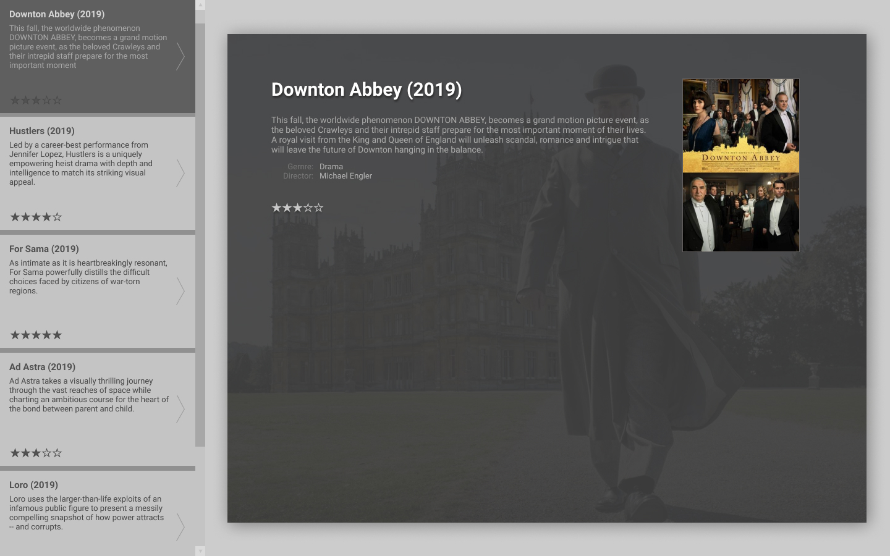

# movieReviews
Info Site about movies



- Hintergrundbid für den Hauptinhalt:
Für Hintergrundbilder kann man keine Transparenz festlegen. Deshalb müssen wir mit **opacity** für Container arbeiten. Wir erzeugen also mit **:after** ein virtuelles Element, das wir mit opacity durchsichtig machen. Für dieses Element definieren wir das Hintergrundbild.

- SCSS-Dateien für **Mixin**s und **Variablen**, die in die Hauptdatei **import**iert werden
- Sterne mit **Mixin** einfügen
- **SASS-Variablen** für Farben und Breakpoints benutzen
- **Text-Shadow** für Hauptüberschrift
- **Box-Shadow** für Container mit Hauptinhalt
- Aufteilung der Bereiche mit **flex-box**
- kein float benutzen
- Scrollleiste mit **overflow: scroll** oder **overflow: auto**
- In Menü-Elementen zu lange Texte mit **overflow: hidden** abschneiden
- In Menü-Elementen Worttrennung mit **whitespace** und **overflow-wrap** kontrollieren
- Pfeil für Menü-Elemente mit **:after** hinzufügen

### Bonus
- **Media-Query** für einspaltige Darstellung auf mobile


## Hilfe
###### Mixin definieren
```scss
@mixin name {
  property: value;
}
```
###### Mixin verwenden
```scss
@include reset-list
```
###### Mixin mit parametern
```scss
@mixin name($parameter) {
  property: $parameter;
}
```
###### Mixin mit parametern verwenden
```scss
@include name(value)
```
###### Variable definieren und Wert zuweisen
```scss
$name: value;
```
###### Variable verwenden
```scss
property: $name;
```
###### Scrollleiste hinzufügen
```css
overflow: scroll;
```
###### Überstehenden Inhalt abschneiden
```css
overflow: hidden;
```
###### Nur wenn Inhalt größer als Container, Scrollleiste anzeigen
```css
overflow: auto;
```
###### Text-Schatten
```css
text-shadow: h-shadow v-shadow blur-radius color;
```
###### Container-Schatten
```css
box-shadow: h-offset v-offset blur spread color;
```
